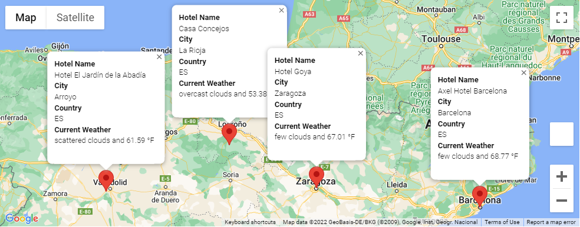

# World_Weather_Analysis

## Project Overview
Uses data from OpenWeatherMap's Weather API and the citipy package to obtain samples of weather data for many worldwide cities from randomized latitudes and longitudes and stores various features of weather data as a DataFrame and CSV file. The purpose of gathering this data is to create a database of potential vacation locations that can be selected by a user supplying various criterias for their desired weather. A sample vacation search is created by filtering the previous into a Pandas DataFrame of a user inputted temperature range and the locations marked using the Google Maps Platform via the gmaps package. Lastly a sample itinerary is produced from a subset of the destination locations and another gmaps map is produced that gives a travel route using the `directions_layer` that operates with Google Maps Platform's Directions API.

### Sample Result Map

